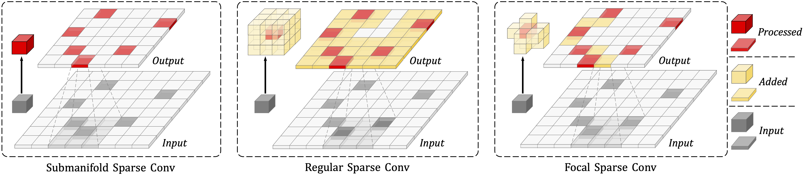
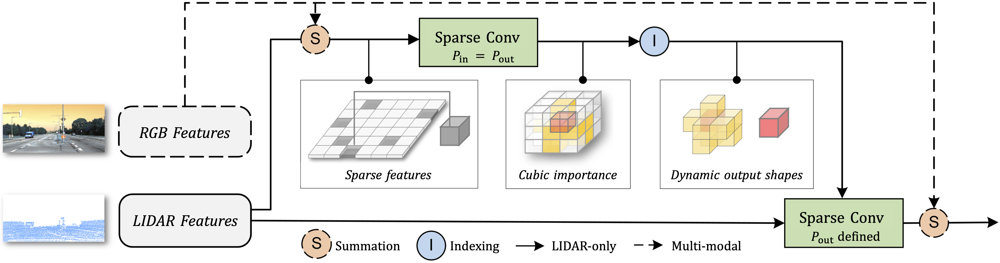
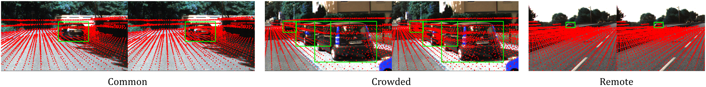

[](https://arxiv.org/abs/2204.12463)


# Focal Sparse Convolutional Networks for 3D Object Detection (CVPR 2022, Oral)

This is the official implementation of ***Focals Conv*** (CVPR 2022), a new sparse convolution design for 3D object detection (feasible for both lidar-only and multi-modal settings). For more details, please refer to:

**Focal Sparse Convolutional Networks for 3D Object Detection [[Paper](https://arxiv.org/abs/2204.12463)]** <br />
Yukang Chen, Yanwei Li, Xiangyu Zhang, Jian Sun, Jiaya Jia<br />

<p align="center">  </p>

<p align="center">  </p>

## News
- [2023-01-05] The ***CUDA version*** of Focals Conv is released in [spconv-plus](https://github.com/dvlab-research/spconv-plus), including some other sparse operators. The example for using it can be found [here](https://github.com/dvlab-research/FocalsConv/blob/master/OpenPCDet/pcdet/models/backbones_3d/focal_sparse_conv/focal_sparse_conv_cuda.py).
- [2022-08-24] The code and example for ***test-time augmentations*** have been released [here](https://github.com/dvlab-research/FocalsConv/tree/master/CenterPoint/test_aug_examples).
- [2022-07-05] The code for ***Focals Conv*** has been marged into the official codebase [OpenPCDet](https://github.com/open-mmlab/OpenPCDet).
- [2022-06-21] The other 3D backbone network design is presented ***LargeKernel3D*** [[Paper](https://arxiv.org/abs/2206.10555) \| [Github](https://github.com/dvlab-research/LargeKernel3D)]. 


### Experimental results

#### KITTI dataset
|                                             | Car@R11 | Car@R40  |download | 
|---------------------------------------------|-------:|:-------:|:---------:|
| [PV-RCNN + Focals Conv](OpenPCDet/tools/cfgs/kitti_models/pv_rcnn_focal_lidar.yaml) | 83.91 | 85.20 | [Google](https://drive.google.com/file/d/1XOpIzHKtkEj9BNrQR6VYADO_T5yaOiJq/view?usp=sharing) \| [Baidu](https://pan.baidu.com/s/1t1Gk8bDv8Q_Dd5vB4VtChA) (key: m15b) |
| [PV-RCNN + Focals Conv (multimodal)](OpenPCDet/tools/cfgs/kitti_models/pv_rcnn_focal_multimodal.yaml) | 84.58 | 85.34 | [Google](https://drive.google.com/file/d/183araPcEmYSlruife2nszKeJv1KH2spg/view?usp=sharing) \| [Baidu](https://pan.baidu.com/s/10XodrSazMFDFnTRdKIfbKA) (key: ie6n) |
| [Voxel R-CNN (Car) + Focals Conv (multimodal)](OpenPCDet/tools/cfgs/kitti_models/voxel_rcnn_car_focal_multimodal.yaml) | 85.68 | 86.00 | [Google](https://drive.google.com/file/d/1M7IUosz4q4qHKEZeRLIIBQ6Wj1-0Wjdg/view?usp=sharing) \| [Baidu](https://pan.baidu.com/s/1bIN3zDmPXrURMOPg7pukzA) (key: tnw9) |


#### nuScenes dataset

|                                             | mAP | NDS | download | 
|---------------------------------------------|----------:|:-------:|:---------:|
| [CenterPoint + Focals Conv (multi-modal)](CenterPoint/configs/nusc/voxelnet/nusc_centerpoint_voxelnet_0075voxel_fix_bn_z_focal_multimodal.py) | 63.86	| 69.41	 | [Google](https://drive.google.com/file/d/12VXMl6RQcz87OWPxXJsB_Nb0MdimsTiG/view?usp=sharing) \| [Baidu](https://pan.baidu.com/s/1ZXn-fhmeL6AsveV2G3n5Jg) (key: 01jh) | 
| [CenterPoint + Focals Conv (multi-modal) - 1/4 data](CenterPoint/configs/nusc/voxelnet/nusc_centerpoint_voxelnet_0075voxel_fix_bn_z_focal_multimodal_1_4_data.py) | 62.15	| 67.45	 | [Google](https://drive.google.com/file/d/1HC3nTEE8GVhInquwRd9hRJPSsZZylR58/view?usp=sharing) \| [Baidu](https://pan.baidu.com/s/1tKlO4GgzjXojzjzpoJY_Ng) (key: 6qsc) | 

Visualization of voxel distribution of Focals Conv on KITTI val dataset:
<p align="center">  </p>


## Getting Started
### Installation

#### a. Clone this repository
```shell
https://github.com/dvlab-research/FocalsConv && cd FocalsConv
```
#### b. Install the environment

Following the install documents for [OpenPCdet](OpenPCDet/docs/INSTALL.md) and [CenterPoint](CenterPoint/docs/INSTALL.md) codebases respectively, based on your preference.

*spconv 2.x is highly recommended instead of spconv 1.x version.

#### c. Prepare the datasets. 

Download and organize the official [KITTI](OpenPCDet/docs/GETTING_STARTED.md) and [Waymo](OpenPCDet/docs/GETTING_STARTED.md) following the document in OpenPCdet, and [nuScenes](CenterPoint/docs/NUSC.md) from the CenterPoint codebase.

*Note that for nuScenes dataset, we use image-level gt-sampling (copy-paste) in the multi-modal training.
Please download this [dbinfos_train_10sweeps_withvelo.pkl](https://drive.google.com/file/d/1ypJKpZifM-NsGdUSLMFpBo-KaXlfpplR/view?usp=sharing) to replace the original one. ([Google](https://drive.google.com/file/d/1ypJKpZifM-NsGdUSLMFpBo-KaXlfpplR/view?usp=sharing) \| [Baidu](https://pan.baidu.com/s/1iz1KWthc1XhXG3du3QG__w) (key: b466))

*Note that for nuScenes dataset, we conduct ablation studies on a 1/4 data training split. 
Please download [infos_train_mini_1_4_10sweeps_withvelo_filter_True.pkl](https://drive.google.com/file/d/19-Zo8o0OWZYed0UpnOfDqTY5oLXKJV9Q/view?usp=sharing) if you needed for training. ([Google](https://drive.google.com/file/d/19-Zo8o0OWZYed0UpnOfDqTY5oLXKJV9Q/view?usp=sharing) \| [Baidu](https://pan.baidu.com/s/1VbkNBs155JyJLhNtSlbEGQ) (key: 769e))

#### d. Download pre-trained models.
If you want to directly evaluate the trained models we provide, please download them first.

If you want to train by yourselvef, for multi-modal settings, please download this resnet pre-train model first,
[torchvision-res50-deeplabv3](https://download.pytorch.org/models/deeplabv3_resnet50_coco-cd0a2569.pth).


### Evaluation
We provide the trained weight file so you can just run with that. You can also use the model you trained.

For models in OpenPCdet, 
```shell
NUM_GPUS=8
cd tools 
bash scripts/dist_test.sh ${NUM_GPUS} --cfg_file cfgs/kitti_models/voxel_rcnn_car_focal_multimodal.yaml --ckpt path/to/voxelrcnn_focal_multimodal.pth

bash scripts/dist_test.sh ${NUM_GPUS} --cfg_file cfgs/kitti_models/pv_rcnn_focal_multimodal.yaml --ckpt ../pvrcnn_focal_multimodal.pth

bash scripts/dist_test.sh ${NUM_GPUS} --cfg_file cfgs/kitti_models/pv_rcnn_focal_lidar.yaml --ckpt path/to/pvrcnn_focal_lidar.pth
```

For models in CenterPoint, 
```shell
CONFIG="nusc_centerpoint_voxelnet_0075voxel_fix_bn_z_focal_multimodal"
python -m torch.distributed.launch --nproc_per_node=${NUM_GPUS} ./tools/dist_test.py configs/nusc/voxelnet/$CONFIG.py --work_dir ./work_dirs/$CONFIG --checkpoint centerpoint_focal_multimodal.pth
```


### Training

For configures in OpenPCdet,
```shell
bash scripts/dist_train.sh ${NUM_GPUS} --cfg_file cfgs/kitti_models/CONFIG.yaml
```

For configures in CenterPoint,
```shell
python -m torch.distributed.launch --nproc_per_node=${NUM_GPUS} ./tools/train.py configs/nusc/voxelnet/$CONFIG.py --work_dir ./work_dirs/CONFIG
```

* Note that we use 8 GPUs to train OpenPCdet models and 4 GPUs to train CenterPoint models.

* Note that for model size counting of multi-modal model, please refer to this [issue](https://github.com/dvlab-research/FocalsConv/issues/9).

## Citation 
If you find this project useful in your research, please consider citing:

```
@inproceedings{focalsconv-chen,
  title={Focal Sparse Convolutional Networks for 3D Object Detection},
  author={Chen, Yukang and Li, Yanwei and Zhang, Xiangyu and Sun, Jian and Jia, Jiaya},
  booktitle={Proceedings of the IEEE Conference on Computer Vision and Pattern Recognition},
  year={2022}
}
```

## Acknowledgement
-  This work is built upon the `OpenPCDet` and `CenterPoint`. Please refer to the official github repositories, [OpenPCDet](https://github.com/open-mmlab/OpenPCDet) and [CenterPoint](https://github.com/tianweiy/CenterPoint) for more information.

-  This README follows the style of [IA-SSD](https://github.com/yifanzhang713/IA-SSD).


## License

This project is released under the [Apache 2.0 license](LICENSE).


## Related Repos
1. [spconv](https://github.com/traveller59/spconv) 
2. [Deformable Conv](https://github.com/msracver/Deformable-ConvNets) 
3. [Submanifold Sparse Conv](https://github.com/facebookresearch/SparseConvNet) 
